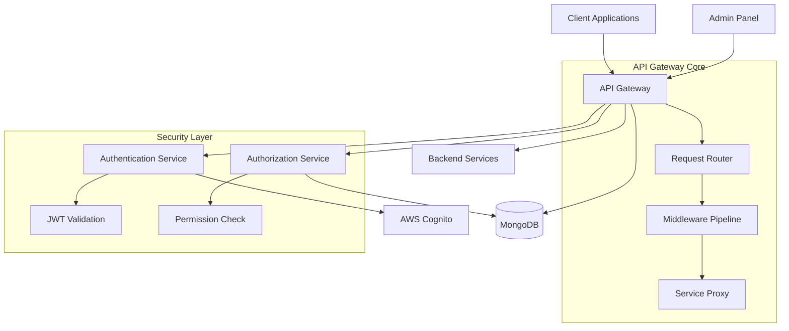
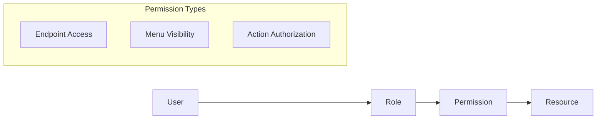
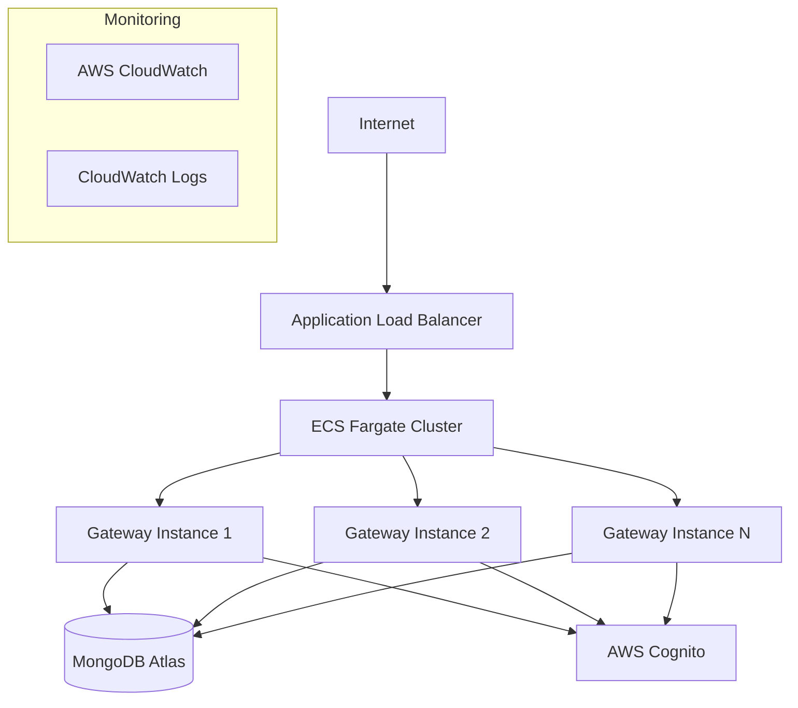

# Project Overview & Architecture

## 1.1 System Architecture Overview

The Multi-Tenant API Gateway is designed as a secure, scalable solution that provides authentication, authorization, and request routing for multiple tenants. The system follows a microservices architecture pattern with clear separation of concerns.

### High-Level Architecture



### Core Components

1. **API Gateway Core**: Central routing and middleware processing
2. **Authentication Service**: JWT token validation with AWS Cognito
3. **Authorization Service**: Role-based access control (RBAC)
4. **Tenant Management**: Multi-tenant data isolation and configuration
5. **Admin Panel**: Web interface for system administration
6. **Audit & Logging**: Comprehensive request and security logging

### Data Flow

1. Client sends request with JWT token
2. Gateway validates token with AWS Cognito
3. System extracts tenant and user information
4. RBAC system checks permissions
5. Request is routed to appropriate backend service
6. Response is returned with audit logging

## 1.2 Technology Stack

### Backend Technologies
- **Runtime**: Node.js 18+
- **Framework**: Fastify (high-performance web framework)
- **Database**: MongoDB (with multi-tenant data isolation)
- **Authentication**: AWS Cognito (JWT token management)
- **Caching**: Redis (optional, for performance optimization)

### Frontend Technologies
- **Framework**: React 18+ or Vue.js 3+
- **State Management**: Redux Toolkit / Pinia
- **UI Library**: Material-UI / Ant Design
- **Build Tool**: Vite

### Infrastructure
- **Cloud Provider**: AWS
- **Container**: Docker
- **Orchestration**: AWS ECS / Kubernetes
- **Database Hosting**: MongoDB Atlas
- **Monitoring**: AWS CloudWatch, DataDog

### Development Tools
- **Language**: TypeScript
- **Testing**: Jest, Supertest
- **API Documentation**: Swagger/OpenAPI
- **Code Quality**: ESLint, Prettier
- **CI/CD**: GitHub Actions / AWS CodePipeline

## 1.3 Multi-Tenant Architecture Patterns

### Data Isolation Strategy

We implement **Shared Database, Shared Schema** pattern with logical isolation:

```javascript
// Example tenant-aware query
const getUsersByTenant = async (tenantId) => {
  return await db.collection('users').find({ 
    tenantId: tenantId,
    isActive: true 
  }).toArray();
};
```

### Tenant Identification

Tenants are identified through JWT claims:

```json
{
  "sub": "user-uuid",
  "tenantId": "tenant-123",
  "roles": ["admin", "user"],
  "permissions": ["read:users", "write:users"],
  "iat": 1640995200,
  "exp": 1641081600
}
```

### Benefits of This Approach

1. **Cost Effective**: Single database instance for all tenants
2. **Scalable**: Easy to add new tenants without infrastructure changes
3. **Maintainable**: Single codebase with tenant-aware logic
4. **Secure**: Logical isolation prevents cross-tenant data access

### Tenant Data Model

```javascript
const tenantSchema = {
  _id: ObjectId,
  tenantId: String, // Unique identifier
  name: String,
  domain: String, // Optional custom domain
  settings: {
    maxUsers: Number,
    features: [String],
    customization: Object
  },
  status: String, // active, suspended, inactive
  createdAt: Date,
  updatedAt: Date
};
```

## 1.4 Security Architecture

### Security Layers

1. **Transport Security**: HTTPS/TLS encryption
2. **Authentication**: JWT token validation
3. **Authorization**: Role-based access control
4. **Data Security**: Tenant isolation and encryption
5. **Network Security**: CORS, rate limiting, IP whitelisting

### JWT Token Security

```javascript
// JWT validation middleware
const validateJWT = async (request, reply) => {
  try {
    const token = extractToken(request.headers.authorization);
    const decoded = await verifyToken(token);
    
    request.user = {
      userId: decoded.sub,
      tenantId: decoded.tenantId,
      roles: decoded.roles,
      permissions: decoded.permissions
    };
  } catch (error) {
    reply.code(401).send({ error: 'Invalid token' });
  }
};
```

### RBAC Security Model



## 1.5 Deployment Architecture

### AWS Infrastructure



### Scaling Considerations

1. **Horizontal Scaling**: Multiple gateway instances behind load balancer
2. **Database Scaling**: MongoDB sharding for large datasets
3. **Caching**: Redis for frequently accessed data
4. **CDN**: CloudFront for static assets

### Environment Configuration

```yaml
# docker-compose.yml example
version: '3.8'
services:
  api-gateway:
    build: .
    ports:
      - "3000:3000"
    environment:
      - NODE_ENV=production
      - MONGODB_URI=${MONGODB_URI}
      - AWS_COGNITO_USER_POOL_ID=${COGNITO_USER_POOL_ID}
      - AWS_COGNITO_CLIENT_ID=${COGNITO_CLIENT_ID}
      - JWT_SECRET=${JWT_SECRET}
    depends_on:
      - mongodb
      
  mongodb:
    image: mongo:6.0
    ports:
      - "27017:27017"
    volumes:
      - mongodb_data:/data/db

volumes:
  mongodb_data:
```

## Key Design Principles

1. **Security First**: Every request is authenticated and authorized
2. **Tenant Isolation**: Complete logical separation of tenant data
3. **Performance**: Optimized for high throughput and low latency
4. **Scalability**: Designed to handle growth in tenants and users
5. **Maintainability**: Clean architecture with clear separation of concerns
6. **Observability**: Comprehensive logging and monitoring

## Next Steps

1. Set up development environment (Section 2.2)
2. Configure AWS Cognito integration (Section 3.1)
3. Implement MongoDB multi-tenant design (Section 4.1)
4. Build core API gateway functionality (Section 6) 