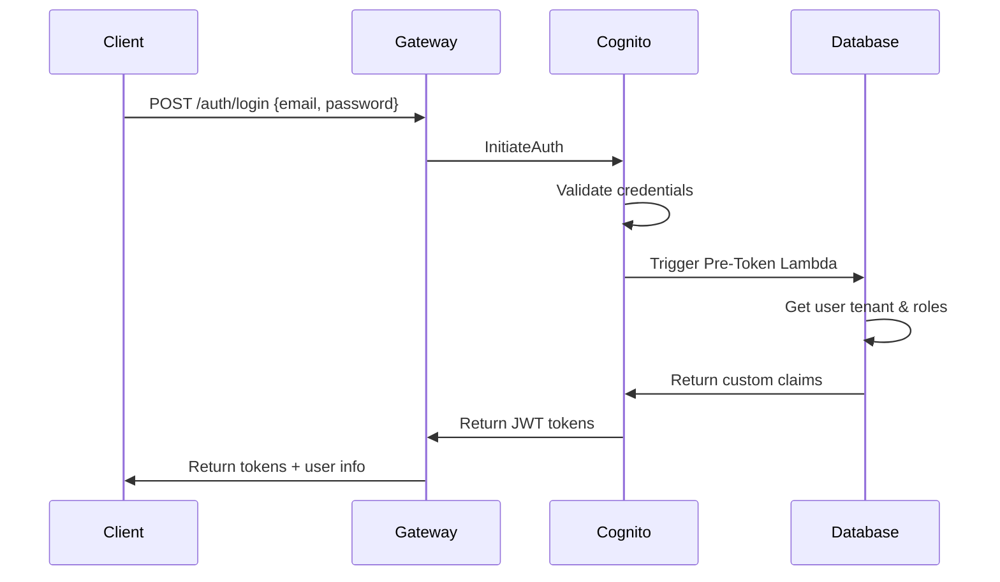

# Authentication & Authorization (Epic 1)

## 3.1 AWS Cognito Integration

### 3.1.1 Cognito User Pool Configuration

AWS Cognito serves as our identity provider, handling user authentication and JWT token generation.

#### User Pool Setup

```bash
# Create User Pool via AWS CLI
aws cognito-idp create-user-pool \
  --pool-name "api-gateway-users" \
  --policies '{
    "PasswordPolicy": {
      "MinimumLength": 8,
      "RequireUppercase": true,
      "RequireLowercase": true,
      "RequireNumbers": true,
      "RequireSymbols": false
    }
  }' \
  --auto-verified-attributes email \
  --username-attributes email \
  --verification-message-template '{
    "DefaultEmailOption": "CONFIRM_WITH_CODE",
    "DefaultEmailSubject": "Your verification code",
    "DefaultEmailMessage": "Your verification code is {####}"
  }'
```

#### App Client Configuration

```bash
# Create App Client
aws cognito-idp create-user-pool-client \
  --user-pool-id us-east-1_XXXXXXXXX \
  --client-name "api-gateway-client" \
  --generate-secret \
  --explicit-auth-flows ADMIN_NO_SRP_AUTH ALLOW_USER_PASSWORD_AUTH ALLOW_REFRESH_TOKEN_AUTH \
  --token-validity-units '{
    "AccessToken": "hours",
    "IdToken": "hours",
    "RefreshToken": "days"
  }' \
  --access-token-validity 24 \
  --id-token-validity 24 \
  --refresh-token-validity 30
```

#### Custom Attributes for Multi-Tenancy

```javascript
// Add custom attributes via AWS SDK
const customAttributes = [
  {
    Name: 'tenantId',
    AttributeDataType: 'String',
    Required: true,
    Mutable: true
  },
  {
    Name: 'roles',
    AttributeDataType: 'String',
    Required: false,
    Mutable: true
  }
];
```

### 3.1.2 JWT Token Structure and Claims

#### Standard JWT Claims

```json
{
  "sub": "user-uuid-from-cognito",
  "aud": "your-cognito-client-id",
  "iss": "https://cognito-idp.us-east-1.amazonaws.com/us-east-1_XXXXXXXXX",
  "token_use": "access",
  "scope": "aws.cognito.signin.user.admin",
  "auth_time": 1640995200,
  "iat": 1640995200,
  "exp": 1641081600,
  "jti": "token-unique-id"
}
```

#### Custom Claims for Multi-Tenancy

```json
{
  "sub": "user-uuid",
  "email": "user@example.com",
  "tenantId": "tenant-123",
  "roles": ["admin", "user"],
  "permissions": ["read:users", "write:users", "delete:users"],
  "custom:department": "engineering",
  "custom:level": "senior"
}
```

#### Pre-Token Generation Lambda

```javascript
// Lambda function to add custom claims
exports.handler = async (event) => {
  // Get user's tenant and roles from database
  const userId = event.request.userAttributes.sub;
  const userDetails = await getUserDetails(userId);
  
  // Add custom claims
  event.response.claimsOverrideDetails = {
    claimsToAddOrOverride: {
      tenantId: userDetails.tenantId,
      roles: JSON.stringify(userDetails.roles),
      permissions: JSON.stringify(userDetails.permissions)
    }
  };
  
  return event;
};
```

### 3.1.3 Federated Identity Providers Setup

#### Google OAuth Integration

```javascript
// Cognito Identity Provider configuration
const googleProvider = {
  ProviderName: 'Google',
  ProviderType: 'Google',
  ProviderDetails: {
    client_id: 'your-google-client-id.googleusercontent.com',
    client_secret: 'your-google-client-secret',
    authorize_scopes: 'email openid profile'
  },
  AttributeMapping: {
    email: 'email',
    given_name: 'given_name',
    family_name: 'family_name'
  }
};
```

#### SAML Integration

```javascript
// SAML Identity Provider configuration
const samlProvider = {
  ProviderName: 'CorporateSSO',
  ProviderType: 'SAML',
  ProviderDetails: {
    MetadataURL: 'https://your-idp.com/metadata',
    IDPSignout: 'true'
  },
  AttributeMapping: {
    email: 'http://schemas.xmlsoap.org/ws/2005/05/identity/claims/emailaddress',
    given_name: 'http://schemas.xmlsoap.org/ws/2005/05/identity/claims/givenname',
    family_name: 'http://schemas.xmlsoap.org/ws/2005/05/identity/claims/surname'
  }
};
```

## 3.2 JWT Token Validation

### 3.2.1 Token Verification Middleware

```typescript
// src/middleware/auth.ts
import jwt from 'jsonwebtoken';
import jwksClient from 'jwks-rsa';
import { FastifyRequest, FastifyReply } from 'fastify';

interface JWTPayload {
  sub: string;
  email: string;
  tenantId: string;
  roles: string[];
  permissions: string[];
  iat: number;
  exp: number;
}

const client = jwksClient({
  jwksUri: `https://cognito-idp.${process.env.AWS_REGION}.amazonaws.com/${process.env.AWS_COGNITO_USER_POOL_ID}/.well-known/jwks.json`,
  cache: true,
  cacheMaxEntries: 5,
  cacheMaxAge: 600000 // 10 minutes
});

const getKey = (header: any, callback: any) => {
  client.getSigningKey(header.kid, (err, key) => {
    if (err) {
      callback(err);
      return;
    }
    const signingKey = key?.getPublicKey();
    callback(null, signingKey);
  });
};

export const authenticateToken = async (
  request: FastifyRequest,
  reply: FastifyReply
) => {
  try {
    const authHeader = request.headers.authorization;
    
    if (!authHeader || !authHeader.startsWith('Bearer ')) {
      return reply.code(401).send({
        error: 'Unauthorized',
        message: 'Missing or invalid authorization header'
      });
    }

    const token = authHeader.substring(7);
    
    // Verify token
    const decoded = await new Promise<JWTPayload>((resolve, reject) => {
      jwt.verify(token, getKey, {
        audience: process.env.AWS_COGNITO_CLIENT_ID,
        issuer: `https://cognito-idp.${process.env.AWS_REGION}.amazonaws.com/${process.env.AWS_COGNITO_USER_POOL_ID}`,
        algorithms: ['RS256']
      }, (err, decoded) => {
        if (err) reject(err);
        else resolve(decoded as JWTPayload);
      });
    });

    // Add user info to request
    request.user = {
      userId: decoded.sub,
      email: decoded.email,
      tenantId: decoded.tenantId,
      roles: Array.isArray(decoded.roles) ? decoded.roles : JSON.parse(decoded.roles || '[]'),
      permissions: Array.isArray(decoded.permissions) ? decoded.permissions : JSON.parse(decoded.permissions || '[]')
    };

  } catch (error) {
    request.log.error('Token validation failed:', error);
    return reply.code(401).send({
      error: 'Unauthorized',
      message: 'Invalid or expired token'
    });
  }
};
```

### 3.2.2 Public Key Validation

```typescript
// src/services/cognito.ts
import { CognitoIdentityServiceProvider } from 'aws-sdk';

export class CognitoService {
  private cognito: CognitoIdentityServiceProvider;
  private jwksCache: Map<string, any> = new Map();

  constructor() {
    this.cognito = new CognitoIdentityServiceProvider({
      region: process.env.AWS_REGION
    });
  }

  async getPublicKeys(): Promise<any> {
    const cacheKey = 'jwks';
    
    if (this.jwksCache.has(cacheKey)) {
      return this.jwksCache.get(cacheKey);
    }

    try {
      const response = await fetch(
        `https://cognito-idp.${process.env.AWS_REGION}.amazonaws.com/${process.env.AWS_COGNITO_USER_POOL_ID}/.well-known/jwks.json`
      );
      
      const jwks = await response.json();
      
      // Cache for 10 minutes
      this.jwksCache.set(cacheKey, jwks);
      setTimeout(() => this.jwksCache.delete(cacheKey), 600000);
      
      return jwks;
    } catch (error) {
      throw new Error('Failed to fetch JWKS');
    }
  }

  async validateTokenSignature(token: string): Promise<boolean> {
    try {
      const jwks = await this.getPublicKeys();
      const header = jwt.decode(token, { complete: true })?.header;
      
      if (!header?.kid) {
        return false;
      }

      const key = jwks.keys.find((k: any) => k.kid === header.kid);
      if (!key) {
        return false;
      }

      // Convert JWK to PEM format
      const publicKey = jwkToPem(key);
      
      jwt.verify(token, publicKey, { algorithms: ['RS256'] });
      return true;
    } catch (error) {
      return false;
    }
  }
}
```

### 3.2.3 Token Refresh Handling

```typescript
// src/services/tokenRefresh.ts
export class TokenRefreshService {
  async refreshAccessToken(refreshToken: string): Promise<{
    accessToken: string;
    idToken: string;
    expiresIn: number;
  }> {
    const params = {
      AuthFlow: 'REFRESH_TOKEN_AUTH',
      ClientId: process.env.AWS_COGNITO_CLIENT_ID!,
      AuthParameters: {
        REFRESH_TOKEN: refreshToken
      }
    };

    try {
      const result = await this.cognito.initiateAuth(params).promise();
      
      return {
        accessToken: result.AuthenticationResult!.AccessToken!,
        idToken: result.AuthenticationResult!.IdToken!,
        expiresIn: result.AuthenticationResult!.ExpiresIn!
      };
    } catch (error) {
      throw new Error('Token refresh failed');
    }
  }

  // Middleware to automatically refresh expired tokens
  async autoRefreshMiddleware(
    request: FastifyRequest,
    reply: FastifyReply
  ) {
    const token = extractToken(request.headers.authorization);
    
    if (!token) {
      return reply.code(401).send({ error: 'No token provided' });
    }

    try {
      // Check if token is expired
      const decoded = jwt.decode(token) as any;
      const now = Math.floor(Date.now() / 1000);
      
      if (decoded.exp < now) {
        // Token is expired, try to refresh
        const refreshToken = request.headers['x-refresh-token'] as string;
        
        if (refreshToken) {
          const newTokens = await this.refreshAccessToken(refreshToken);
          
          // Add new tokens to response headers
          reply.header('x-new-access-token', newTokens.accessToken);
          reply.header('x-new-id-token', newTokens.idToken);
          
          // Update request with new token
          request.headers.authorization = `Bearer ${newTokens.accessToken}`;
        } else {
          return reply.code(401).send({ error: 'Token expired and no refresh token provided' });
        }
      }
    } catch (error) {
      return reply.code(401).send({ error: 'Invalid token' });
    }
  }
}
```

## 3.3 Authentication Flow

### 3.3.1 User Login Process



#### Login Endpoint Implementation

```typescript
// src/controllers/auth.ts
export class AuthController {
  async login(request: FastifyRequest, reply: FastifyReply) {
    const { email, password } = request.body as {
      email: string;
      password: string;
    };

    try {
      // Authenticate with Cognito
      const authResult = await this.cognitoService.authenticateUser(email, password);
      
      // Decode token to get user info
      const userInfo = jwt.decode(authResult.AccessToken) as any;
      
      // Get additional user details from database
      const userDetails = await this.userService.getUserByEmail(email);
      
      return reply.send({
        success: true,
        data: {
          accessToken: authResult.AccessToken,
          idToken: authResult.IdToken,
          refreshToken: authResult.RefreshToken,
          expiresIn: authResult.ExpiresIn,
          user: {
            id: userInfo.sub,
            email: userInfo.email,
            tenantId: userInfo.tenantId,
            roles: userInfo.roles,
            permissions: userInfo.permissions,
            profile: userDetails.profile
          }
        }
      });
    } catch (error) {
      request.log.error('Login failed:', error);
      
      return reply.code(401).send({
        error: 'Authentication failed',
        message: 'Invalid email or password'
      });
    }
  }

  async logout(request: FastifyRequest, reply: FastifyReply) {
    const { refreshToken } = request.body as { refreshToken: string };

    try {
      // Revoke refresh token in Cognito
      await this.cognitoService.revokeToken(refreshToken);
      
      // Add token to blacklist (optional)
      await this.tokenBlacklistService.addToken(
        extractToken(request.headers.authorization)
      );
      
      return reply.send({
        success: true,
        message: 'Logged out successfully'
      });
    } catch (error) {
      request.log.error('Logout failed:', error);
      return reply.code(500).send({
        error: 'Logout failed'
      });
    }
  }
}
```

### 3.3.2 Token Lifecycle Management

```typescript
// src/services/tokenLifecycle.ts
export class TokenLifecycleService {
  private blacklistedTokens: Set<string> = new Set();

  async isTokenBlacklisted(token: string): Promise<boolean> {
    // Check in-memory blacklist
    if (this.blacklistedTokens.has(token)) {
      return true;
    }

    // Check database blacklist for distributed systems
    const blacklisted = await this.db.collection('blacklisted_tokens')
      .findOne({ token: this.hashToken(token) });
    
    return !!blacklisted;
  }

  async blacklistToken(token: string, reason: string = 'logout'): Promise<void> {
    const tokenHash = this.hashToken(token);
    const decoded = jwt.decode(token) as any;
    
    // Add to in-memory blacklist
    this.blacklistedTokens.add(token);
    
    // Add to database blacklist
    await this.db.collection('blacklisted_tokens').insertOne({
      tokenHash,
      userId: decoded.sub,
      tenantId: decoded.tenantId,
      reason,
      blacklistedAt: new Date(),
      expiresAt: new Date(decoded.exp * 1000)
    });
  }

  async cleanupExpiredTokens(): Promise<void> {
    const now = new Date();
    
    // Remove expired tokens from database
    await this.db.collection('blacklisted_tokens').deleteMany({
      expiresAt: { $lt: now }
    });
    
    // Clear in-memory blacklist periodically
    this.blacklistedTokens.clear();
  }

  private hashToken(token: string): string {
    return crypto.createHash('sha256').update(token).digest('hex');
  }
}
```

### 3.3.3 Error Handling and Logging

```typescript
// src/middleware/authErrorHandler.ts
export const authErrorHandler = (
  error: Error,
  request: FastifyRequest,
  reply: FastifyReply
) => {
  const authError = {
    timestamp: new Date().toISOString(),
    requestId: request.id,
    ip: request.ip,
    userAgent: request.headers['user-agent'],
    endpoint: request.url,
    method: request.method
  };

  if (error.name === 'JsonWebTokenError') {
    request.log.warn('Invalid JWT token', { ...authError, error: error.message });
    return reply.code(401).send({
      error: 'Unauthorized',
      message: 'Invalid token format',
      code: 'INVALID_TOKEN'
    });
  }

  if (error.name === 'TokenExpiredError') {
    request.log.warn('Expired JWT token', { ...authError, error: error.message });
    return reply.code(401).send({
      error: 'Unauthorized',
      message: 'Token has expired',
      code: 'TOKEN_EXPIRED'
    });
  }

  if (error.name === 'NotBeforeError') {
    request.log.warn('Token not active yet', { ...authError, error: error.message });
    return reply.code(401).send({
      error: 'Unauthorized',
      message: 'Token not active',
      code: 'TOKEN_NOT_ACTIVE'
    });
  }

  // Log unexpected authentication errors
  request.log.error('Authentication error', { ...authError, error: error.message, stack: error.stack });
  
  return reply.code(500).send({
    error: 'Internal Server Error',
    message: 'Authentication service unavailable',
    code: 'AUTH_SERVICE_ERROR'
  });
};
```

## Security Best Practices

### 1. Token Storage
- Store access tokens in memory (not localStorage)
- Store refresh tokens in httpOnly cookies
- Use secure, sameSite cookies in production

### 2. Token Validation
- Always validate token signature
- Check token expiration
- Verify audience and issuer claims
- Implement token blacklisting for logout

### 3. Rate Limiting
```typescript
// Rate limiting for authentication endpoints
const authRateLimit = {
  max: 5, // 5 attempts
  timeWindow: '15 minutes',
  errorResponseBuilder: (request: FastifyRequest, context: any) => ({
    error: 'Too Many Requests',
    message: 'Too many authentication attempts, please try again later',
    retryAfter: Math.round(context.ttl / 1000)
  })
};
```

### 4. Audit Logging
```typescript
// Log all authentication events
const auditLog = {
  event: 'user_login',
  userId: user.id,
  tenantId: user.tenantId,
  ip: request.ip,
  userAgent: request.headers['user-agent'],
  timestamp: new Date(),
  success: true
};
```

## Testing Authentication

### Unit Tests
```typescript
// tests/auth.test.ts
describe('Authentication Middleware', () => {
  it('should validate valid JWT token', async () => {
    const validToken = generateTestToken();
    const request = createMockRequest(validToken);
    const reply = createMockReply();
    
    await authenticateToken(request, reply);
    
    expect(request.user).toBeDefined();
    expect(request.user.tenantId).toBe('test-tenant');
  });

  it('should reject expired token', async () => {
    const expiredToken = generateExpiredToken();
    const request = createMockRequest(expiredToken);
    const reply = createMockReply();
    
    await authenticateToken(request, reply);
    
    expect(reply.code).toHaveBeenCalledWith(401);
  });
});
```

### Integration Tests
```typescript
// tests/integration/auth.test.ts
describe('Authentication Flow', () => {
  it('should complete full login flow', async () => {
    const response = await app.inject({
      method: 'POST',
      url: '/auth/login',
      payload: {
        email: 'test@example.com',
        password: 'TestPassword123!'
      }
    });
    
    expect(response.statusCode).toBe(200);
    expect(response.json().data.accessToken).toBeDefined();
  });
});
``` 