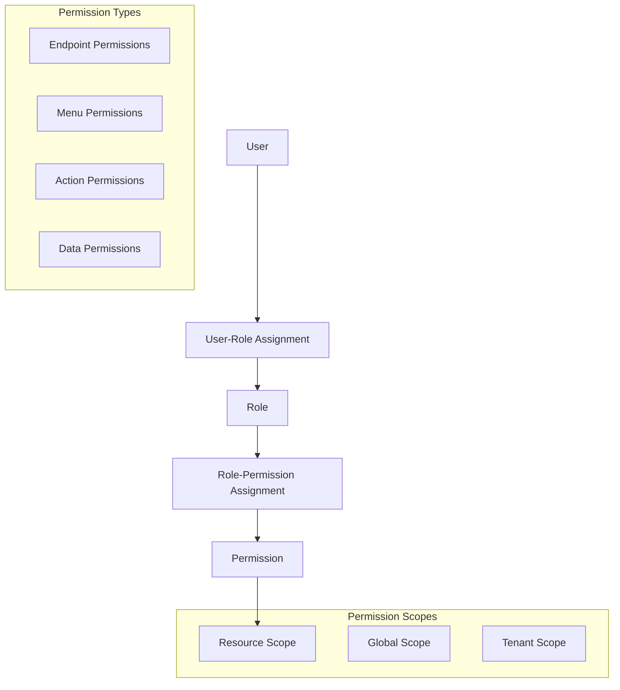

# Role-Based Access Control (Epic 3)

## 5.1 RBAC System Design

### 5.1.1 Role and Permission Model

The RBAC system implements a flexible, hierarchical permission model that supports granular access control across endpoints, UI components, and business actions.

#### Core RBAC Concepts



#### Permission Structure

```typescript
// src/models/permission.ts
export interface Permission {
  action: string;      // read, write, delete, execute
  resource: string;    // users, roles, tenants, api-keys
  scope?: string;      // global, tenant, own
  conditions?: any;    // Additional conditions
}

// Permission string format: action:resource:scope
// Examples:
// - "read:users:tenant"     - Read users within tenant
// - "write:roles:tenant"    - Create/update roles within tenant
// - "delete:users:own"      - Delete own user profile
// - "execute:reports:tenant" - Execute reports within tenant
// - "*:*:*"                 - Full access (superadmin)
```

#### Role Schema

```typescript
// src/models/role.ts
export interface RoleSchema {
  _id: ObjectId;
  tenantId: string;
  name: string;
  description?: string;
  permissions: string[]; // Array of permission strings
  isSystem: boolean;     // System roles cannot be deleted
  isActive: boolean;
  hierarchy: number;     // Role hierarchy level (0 = highest)
  inheritsFrom?: string[]; // Parent roles to inherit permissions from
  metadata: {
    createdBy: ObjectId;
    updatedBy?: ObjectId;
    tags?: string[];
    category?: string;
  };
  createdAt: Date;
  updatedAt: Date;
}
```

### 5.1.2 Permission Types

#### Endpoint Permissions

```typescript
// src/types/permissions.ts
export const ENDPOINT_PERMISSIONS = {
  // User Management
  'read:users:tenant': 'View users in tenant',
  'write:users:tenant': 'Create/update users in tenant',
  'delete:users:tenant': 'Delete users in tenant',
  'read:users:own': 'View own profile',
  'write:users:own': 'Update own profile',
  
  // Role Management
  'read:roles:tenant': 'View roles in tenant',
  'write:roles:tenant': 'Create/update roles in tenant',
  'delete:roles:tenant': 'Delete roles in tenant',
  'assign:roles:tenant': 'Assign roles to users',
  
  // API Key Management
  'read:api-keys:tenant': 'View API keys in tenant',
  'write:api-keys:tenant': 'Create/update API keys in tenant',
  'delete:api-keys:tenant': 'Delete API keys in tenant',
  
  // Audit Logs
  'read:audit-logs:tenant': 'View audit logs in tenant',
  'export:audit-logs:tenant': 'Export audit logs',
  
  // Tenant Settings
  'read:tenant-settings:tenant': 'View tenant settings',
  'write:tenant-settings:tenant': 'Update tenant settings',
  
  // System Administration (Global scope)
  'read:tenants:global': 'View all tenants',
  'write:tenants:global': 'Create/update tenants',
  'delete:tenants:global': 'Delete tenants',
  'suspend:tenants:global': 'Suspend/activate tenants'
};
```

#### Menu Permissions

```typescript
export const MENU_PERMISSIONS = {
  'menu:dashboard': 'Access dashboard',
  'menu:users': 'Access user management',
  'menu:roles': 'Access role management',
  'menu:api-keys': 'Access API key management',
  'menu:audit-logs': 'Access audit logs',
  'menu:settings': 'Access tenant settings',
  'menu:admin': 'Access admin panel (superadmin)',
  'menu:analytics': 'Access analytics dashboard',
  'menu:billing': 'Access billing information'
};
```

#### Action Permissions

```typescript
export const ACTION_PERMISSIONS = {
  'action:export-data': 'Export data',
  'action:import-data': 'Import data',
  'action:bulk-operations': 'Perform bulk operations',
  'action:advanced-search': 'Use advanced search',
  'action:api-access': 'Access API endpoints',
  'action:webhook-config': 'Configure webhooks'
};
```

### 5.1.3 Role Hierarchy and Inheritance

```typescript
// src/services/roleHierarchyService.ts
export class RoleHierarchyService {
  private db: Db;
  private tenantId: string;

  constructor(db: Db, tenantId: string) {
    this.db = db;
    this.tenantId = tenantId;
  }

  async createRoleWithHierarchy(roleData: {
    name: string;
    description?: string;
    permissions: string[];
    hierarchy: number;
    inheritsFrom?: string[];
  }): Promise<RoleSchema> {
    // Validate hierarchy level
    await this.validateHierarchyLevel(roleData.hierarchy);
    
    // Resolve inherited permissions
    const allPermissions = await this.resolveInheritedPermissions(
      roleData.permissions,
      roleData.inheritsFrom || []
    );

    const role: RoleSchema = {
      _id: new ObjectId(),
      tenantId: this.tenantId,
      name: roleData.name,
      description: roleData.description,
      permissions: allPermissions,
      isSystem: false,
      isActive: true,
      hierarchy: roleData.hierarchy,
      inheritsFrom: roleData.inheritsFrom,
      metadata: {
        createdBy: new ObjectId(), // Set from request context
        tags: [],
        category: 'custom'
      },
      createdAt: new Date(),
      updatedAt: new Date()
    };

    await this.db.collection('roles').insertOne(role);
    return role;
  }

  private async validateHierarchyLevel(level: number): Promise<void> {
    // Ensure user can only create roles at their level or below
    const maxLevel = 10; // Define maximum hierarchy levels
    
    if (level < 0 || level > maxLevel) {
      throw new Error(`Invalid hierarchy level. Must be between 0 and ${maxLevel}`);
    }
  }

  private async resolveInheritedPermissions(
    directPermissions: string[],
    parentRoles: string[]
  ): Promise<string[]> {
    const allPermissions = new Set(directPermissions);

    for (const parentRoleName of parentRoles) {
      const parentRole = await this.db.collection('roles').findOne({
        tenantId: this.tenantId,
        name: parentRoleName
      });

      if (parentRole) {
        // Add parent permissions
        parentRole.permissions.forEach(permission => 
          allPermissions.add(permission)
        );

        // Recursively resolve parent's inherited permissions
        if (parentRole.inheritsFrom && parentRole.inheritsFrom.length > 0) {
          const inheritedPermissions = await this.resolveInheritedPermissions(
            [],
            parentRole.inheritsFrom
          );
          inheritedPermissions.forEach(permission => 
            allPermissions.add(permission)
          );
        }
      }
    }

    return Array.from(allPermissions);
  }

  async updateRolePermissions(roleId: string, permissions: string[]): Promise<RoleSchema | null> {
    const role = await this.db.collection('roles').findOne({
      _id: new ObjectId(roleId),
      tenantId: this.tenantId
    });

    if (!role) {
      return null;
    }

    // Resolve permissions with inheritance
    const allPermissions = await this.resolveInheritedPermissions(
      permissions,
      role.inheritsFrom || []
    );

    await this.db.collection('roles').updateOne(
      { _id: new ObjectId(roleId), tenantId: this.tenantId },
      {
        $set: {
          permissions: allPermissions,
          updatedAt: new Date()
        }
      }
    );

    return this.db.collection('roles').findOne({
      _id: new ObjectId(roleId),
      tenantId: this.tenantId
    });
  }
}
```

## 5.2 Role Management API

### 5.2.1 Role CRUD Operations

```typescript
// src/controllers/roleController.ts
export class RoleController {
  private roleService: RoleService;
  private permissionService: PermissionService;

  constructor(db: Db) {
    this.roleService = new RoleService(db);
    this.permissionService = new PermissionService(db);
  }

  // Create new role
  async createRole(request: FastifyRequest, reply: FastifyReply) {
    try {
      const tenantId = request.user.tenantId;
      const { name, description, permissions, hierarchy, inheritsFrom } = request.body as {
        name: string;
        description?: string;
        permissions: string[];
        hierarchy?: number;
        inheritsFrom?: string[];
      };

      // Validate permissions
      const validationResult = await this.permissionService.validatePermissions(
        permissions,
        tenantId
      );

      if (!validationResult.isValid) {
        return reply.code(400).send({
          error: 'Bad Request',
          message: 'Invalid permissions',
          details: validationResult.errors
        });
      }

      // Check if role name already exists
      const existingRole = await this.roleService.findByName(name, tenantId);
      if (existingRole) {
        return reply.code(409).send({
          error: 'Conflict',
          message: 'Role name already exists'
        });
      }

      const role = await this.roleService.create({
        name,
        description,
        permissions,
        hierarchy: hierarchy || 5,
        inheritsFrom,
        tenantId,
        createdBy: new ObjectId(request.user.userId)
      });

      return reply.code(201).send({
        success: true,
        data: role
      });
    } catch (error) {
      request.log.error('Failed to create role:', error);
      return reply.code(500).send({
        error: 'Internal Server Error',
        message: 'Failed to create role'
      });
    }
  }

  // Get role by ID
  async getRole(request: FastifyRequest, reply: FastifyReply) {
    try {
      const { roleId } = request.params as { roleId: string };
      const tenantId = request.user.tenantId;

      const role = await this.roleService.findById(roleId, tenantId);
      
      if (!role) {
        return reply.code(404).send({
          error: 'Not Found',
          message: 'Role not found'
        });
      }

      // Include resolved permissions (with inheritance)
      const resolvedPermissions = await this.roleService.getResolvedPermissions(roleId, tenantId);
      
      return reply.send({
        success: true,
        data: {
          ...role,
          resolvedPermissions
        }
      });
    } catch (error) {
      request.log.error('Failed to get role:', error);
      return reply.code(500).send({
        error: 'Internal Server Error',
        message: 'Failed to retrieve role'
      });
    }
  }

  // List roles
  async listRoles(request: FastifyRequest, reply: FastifyReply) {
    try {
      const tenantId = request.user.tenantId;
      const { 
        page = 1, 
        limit = 10, 
        search, 
        isSystem, 
        isActive,
        category 
      } = request.query as {
        page?: number;
        limit?: number;
        search?: string;
        isSystem?: boolean;
        isActive?: boolean;
        category?: string;
      };

      const filter: any = { tenantId };
      
      if (search) {
        filter.$or = [
          { name: { $regex: search, $options: 'i' } },
          { description: { $regex: search, $options: 'i' } }
        ];
      }

      if (typeof isSystem === 'boolean') {
        filter.isSystem = isSystem;
      }

      if (typeof isActive === 'boolean') {
        filter.isActive = isActive;
      }

      if (category) {
        filter['metadata.category'] = category;
      }

      const skip = (page - 1) * limit;
      
      const [roles, total] = await Promise.all([
        this.db.collection('roles')
          .find(filter)
          .sort({ hierarchy: 1, name: 1 })
          .skip(skip)
          .limit(limit)
          .toArray(),
        this.db.collection('roles').countDocuments(filter)
      ]);

      return reply.send({
        success: true,
        data: {
          roles,
          pagination: {
            page,
            limit,
            total,
            pages: Math.ceil(total / limit)
          }
        }
      });
    } catch (error) {
      request.log.error('Failed to list roles:', error);
      return reply.code(500).send({
        error: 'Internal Server Error',
        message: 'Failed to list roles'
      });
    }
  }

  // Update role
  async updateRole(request: FastifyRequest, reply: FastifyReply) {
    try {
      const { roleId } = request.params as { roleId: string };
      const tenantId = request.user.tenantId;
      const updateData = request.body as Partial<RoleSchema>;

      // Check if role exists and is not system role
      const existingRole = await this.roleService.findById(roleId, tenantId);
      
      if (!existingRole) {
        return reply.code(404).send({
          error: 'Not Found',
          message: 'Role not found'
        });
      }

      if (existingRole.isSystem && !request.user.permissions.includes('*:*:*')) {
        return reply.code(403).send({
          error: 'Forbidden',
          message: 'Cannot modify system roles'
        });
      }

      // Validate permissions if provided
      if (updateData.permissions) {
        const validationResult = await this.permissionService.validatePermissions(
          updateData.permissions,
          tenantId
        );

        if (!validationResult.isValid) {
          return reply.code(400).send({
            error: 'Bad Request',
            message: 'Invalid permissions',
            details: validationResult.errors
          });
        }
      }

      // Remove fields that shouldn't be updated directly
      delete updateData._id;
      delete updateData.tenantId;
      delete updateData.createdAt;
      delete updateData.isSystem;

      const updatedRole = await this.roleService.updateById(roleId, {
        ...updateData,
        'metadata.updatedBy': new ObjectId(request.user.userId),
        updatedAt: new Date()
      }, tenantId);

      return reply.send({
        success: true,
        data: updatedRole
      });
    } catch (error) {
      request.log.error('Failed to update role:', error);
      return reply.code(500).send({
        error: 'Internal Server Error',
        message: 'Failed to update role'
      });
    }
  }

  // Delete role
  async deleteRole(request: FastifyRequest, reply: FastifyReply) {
    try {
      const { roleId } = request.params as { roleId: string };
      const tenantId = request.user.tenantId;

      const role = await this.roleService.findById(roleId, tenantId);
      
      if (!role) {
        return reply.code(404).send({
          error: 'Not Found',
          message: 'Role not found'
        });
      }

      if (role.isSystem) {
        return reply.code(403).send({
          error: 'Forbidden',
          message: 'Cannot delete system roles'
        });
      }

      // Check if role is assigned to any users
      const usersWithRole = await this.db.collection('users').countDocuments({
        tenantId,
        roles: role.name
      });

      if (usersWithRole > 0) {
        return reply.code(409).send({
          error: 'Conflict',
          message: `Cannot delete role. It is assigned to ${usersWithRole} user(s)`
        });
      }

      await this.roleService.deleteById(roleId, tenantId);

      return reply.send({
        success: true,
        message: 'Role deleted successfully'
      });
    } catch (error) {
      request.log.error('Failed to delete role:', error);
      return reply.code(500).send({
        error: 'Internal Server Error',
        message: 'Failed to delete role'
      });
    }
  }
}
```

### 5.2.2 Permission Assignment

```typescript
// src/services/permissionService.ts
export class PermissionService {
  private db: Db;

  constructor(db: Db) {
    this.db = db;
  }

  async validatePermissions(permissions: string[], tenantId: string): Promise<{
    isValid: boolean;
    errors: string[];
  }> {
    const errors: string[] = [];
    const validPermissions = this.getAllValidPermissions();

    for (const permission of permissions) {
      if (!this.isValidPermissionFormat(permission)) {
        errors.push(`Invalid permission format: ${permission}`);
        continue;
      }

      if (!this.isPermissionAllowed(permission, validPermissions)) {
        errors.push(`Unknown permission: ${permission}`);
      }
    }

    return {
      isValid: errors.length === 0,
      errors
    };
  }

  private isValidPermissionFormat(permission: string): boolean {
    // Check format: action:resource:scope or *
    const wildcardPattern = /^\*$/;
    const permissionPattern = /^[a-zA-Z*]+:[a-zA-Z*-]+:[a-zA-Z*]+$/;
    
    return wildcardPattern.test(permission) || permissionPattern.test(permission);
  }

  private isPermissionAllowed(permission: string, validPermissions: string[]): boolean {
    // Allow wildcard permissions
    if (permission === '*' || permission === '*:*:*') {
      return true;
    }

    // Check exact match
    if (validPermissions.includes(permission)) {
      return true;
    }

    // Check wildcard patterns
    const [action, resource, scope] = permission.split(':');
    
    // Check if any valid permission matches the pattern
    return validPermissions.some(validPerm => {
      const [validAction, validResource, validScope] = validPerm.split(':');
      
      return (action === '*' || action === validAction) &&
             (resource === '*' || resource === validResource) &&
             (scope === '*' || scope === validScope);
    });
  }

  private getAllValidPermissions(): string[] {
    return [
      ...Object.keys(ENDPOINT_PERMISSIONS),
      ...Object.keys(MENU_PERMISSIONS),
      ...Object.keys(ACTION_PERMISSIONS)
    ];
  }

  async getPermissionsByCategory(): Promise<{
    endpoints: Record<string, string>;
    menus: Record<string, string>;
    actions: Record<string, string>;
  }> {
    return {
      endpoints: ENDPOINT_PERMISSIONS,
      menus: MENU_PERMISSIONS,
      actions: ACTION_PERMISSIONS
    };
  }

  async assignPermissionsToRole(
    roleId: string,
    permissions: string[],
    tenantId: string
  ): Promise<RoleSchema | null> {
    const validationResult = await this.validatePermissions(permissions, tenantId);
    
    if (!validationResult.isValid) {
      throw new Error(`Invalid permissions: ${validationResult.errors.join(', ')}`);
    }

    const result = await this.db.collection('roles').updateOne(
      { _id: new ObjectId(roleId), tenantId },
      {
        $set: {
          permissions,
          updatedAt: new Date()
        }
      }
    );

    if (result.matchedCount === 0) {
      return null;
    }

    return this.db.collection('roles').findOne({
      _id: new ObjectId(roleId),
      tenantId
    });
  }

  async addPermissionToRole(
    roleId: string,
    permission: string,
    tenantId: string
  ): Promise<RoleSchema | null> {
    const validationResult = await this.validatePermissions([permission], tenantId);
    
    if (!validationResult.isValid) {
      throw new Error(`Invalid permission: ${permission}`);
    }

    const result = await this.db.collection('roles').updateOne(
      { _id: new ObjectId(roleId), tenantId },
      {
        $addToSet: { permissions: permission },
        $set: { updatedAt: new Date() }
      }
    );

    if (result.matchedCount === 0) {
      return null;
    }

    return this.db.collection('roles').findOne({
      _id: new ObjectId(roleId),
      tenantId
    });
  }

  async removePermissionFromRole(
    roleId: string,
    permission: string,
    tenantId: string
  ): Promise<RoleSchema | null> {
    const result = await this.db.collection('roles').updateOne(
      { _id: new ObjectId(roleId), tenantId },
      {
        $pull: { permissions: permission },
        $set: { updatedAt: new Date() }
      }
    );

    if (result.matchedCount === 0) {
      return null;
    }

    return this.db.collection('roles').findOne({
      _id: new ObjectId(roleId),
      tenantId
    });
  }
}
```

### 5.2.3 Role Validation Rules

```typescript
// src/middleware/roleValidation.ts
export const roleValidationRules = {
  createRole: {
    name: {
      required: true,
      type: 'string',
      minLength: 2,
      maxLength: 50,
      pattern: /^[a-zA-Z0-9_-]+$/,
      message: 'Role name must be 2-50 characters, alphanumeric with underscores and hyphens only'
    },
    description: {
      required: false,
      type: 'string',
      maxLength: 200
    },
    permissions: {
      required: true,
      type: 'array',
      minItems: 1,
      items: {
        type: 'string',
        pattern: /^[a-zA-Z*]+:[a-zA-Z*-]+:[a-zA-Z*]+$|^\*$/
      }
    },
    hierarchy: {
      required: false,
      type: 'number',
      minimum: 0,
      maximum: 10
    },
    inheritsFrom: {
      required: false,
      type: 'array',
      items: {
        type: 'string'
      }
    }
  },

  updateRole: {
    name: {
      required: false,
      type: 'string',
      minLength: 2,
      maxLength: 50,
      pattern: /^[a-zA-Z0-9_-]+$/
    },
    description: {
      required: false,
      type: 'string',
      maxLength: 200
    },
    permissions: {
      required: false,
      type: 'array',
      items: {
        type: 'string',
        pattern: /^[a-zA-Z*]+:[a-zA-Z*-]+:[a-zA-Z*]+$|^\*$/
      }
    },
    isActive: {
      required: false,
      type: 'boolean'
    }
  }
};

export const validateRoleData = (data: any, rules: any): {
  isValid: boolean;
  errors: string[];
} => {
  const errors: string[] = [];

  for (const [field, rule] of Object.entries(rules)) {
    const value = data[field];

    // Check required fields
    if (rule.required && (value === undefined || value === null)) {
      errors.push(`${field} is required`);
      continue;
    }

    // Skip validation if field is not provided and not required
    if (value === undefined || value === null) {
      continue;
    }

    // Type validation
    if (rule.type === 'string' && typeof value !== 'string') {
      errors.push(`${field} must be a string`);
      continue;
    }

    if (rule.type === 'number' && typeof value !== 'number') {
      errors.push(`${field} must be a number`);
      continue;
    }

    if (rule.type === 'boolean' && typeof value !== 'boolean') {
      errors.push(`${field} must be a boolean`);
      continue;
    }

    if (rule.type === 'array' && !Array.isArray(value)) {
      errors.push(`${field} must be an array`);
      continue;
    }

    // String validations
    if (rule.type === 'string') {
      if (rule.minLength && value.length < rule.minLength) {
        errors.push(`${field} must be at least ${rule.minLength} characters`);
      }

      if (rule.maxLength && value.length > rule.maxLength) {
        errors.push(`${field} must be at most ${rule.maxLength} characters`);
      }

      if (rule.pattern && !rule.pattern.test(value)) {
        errors.push(rule.message || `${field} format is invalid`);
      }
    }

    // Number validations
    if (rule.type === 'number') {
      if (rule.minimum !== undefined && value < rule.minimum) {
        errors.push(`${field} must be at least ${rule.minimum}`);
      }

      if (rule.maximum !== undefined && value > rule.maximum) {
        errors.push(`${field} must be at most ${rule.maximum}`);
      }
    }

    // Array validations
    if (rule.type === 'array') {
      if (rule.minItems && value.length < rule.minItems) {
        errors.push(`${field} must have at least ${rule.minItems} items`);
      }

      if (rule.maxItems && value.length > rule.maxItems) {
        errors.push(`${field} must have at most ${rule.maxItems} items`);
      }

      // Validate array items
      if (rule.items) {
        value.forEach((item: any, index: number) => {
          if (rule.items.type === 'string' && typeof item !== 'string') {
            errors.push(`${field}[${index}] must be a string`);
          }

          if (rule.items.pattern && !rule.items.pattern.test(item)) {
            errors.push(`${field}[${index}] format is invalid`);
          }
        });
      }
    }
  }

  return {
    isValid: errors.length === 0,
    errors
  };
};
```

## 5.3 User Role Assignment

### 5.3.1 User-Role Mapping

```typescript
// src/services/userRoleService.ts
export class UserRoleService {
  private db: Db;
  private tenantId: string;

  constructor(db: Db, tenantId: string) {
    this.db = db;
    this.tenantId = tenantId;
  }

  async assignRoleToUser(userId: string, roleName: string): Promise<UserSchema | null> {
    // Validate role exists
    const role = await this.db.collection('roles').findOne({
      tenantId: this.tenantId,
      name: roleName,
      isActive: true
    });

    if (!role) {
      throw new Error(`Role '${roleName}' not found or inactive`);
    }

    // Check if user already has the role
    const user = await this.db.collection('users').findOne({
      _id: new ObjectId(userId),
      tenantId: this.tenantId
    });

    if (!user) {
      throw new Error('User not found');
    }

    if (user.roles.includes(roleName)) {
      throw new Error('User already has this role');
    }

    // Assign role
    const result = await this.db.collection('users').updateOne(
      { _id: new ObjectId(userId), tenantId: this.tenantId },
      {
        $addToSet: { roles: roleName },
        $set: { updatedAt: new Date() }
      }
    );

    if (result.matchedCount === 0) {
      return null;
    }

    // Log role assignment
    await this.logRoleAssignment(userId, roleName, 'assigned');

    return this.db.collection('users').findOne({
      _id: new ObjectId(userId),
      tenantId: this.tenantId
    });
  }

  async removeRoleFromUser(userId: string, roleName: string): Promise<UserSchema | null> {
    const result = await this.db.collection('users').updateOne(
      { _id: new ObjectId(userId), tenantId: this.tenantId },
      {
        $pull: { roles: roleName },
        $set: { updatedAt: new Date() }
      }
    );

    if (result.matchedCount === 0) {
      return null;
    }

    // Log role removal
    await this.logRoleAssignment(userId, roleName, 'removed');

    return this.db.collection('users').findOne({
      _id: new ObjectId(userId),
      tenantId: this.tenantId
    });
  }

  async assignMultipleRoles(userId: string, roleNames: string[]): Promise<UserSchema | null> {
    // Validate all roles exist
    const roles = await this.db.collection('roles').find({
      tenantId: this.tenantId,
      name: { $in: roleNames },
      isActive: true
    }).toArray();

    if (roles.length !== roleNames.length) {
      const foundRoles = roles.map(r => r.name);
      const missingRoles = roleNames.filter(name => !foundRoles.includes(name));
      throw new Error(`Roles not found: ${missingRoles.join(', ')}`);
    }

    const result = await this.db.collection('users').updateOne(
      { _id: new ObjectId(userId), tenantId: this.tenantId },
      {
        $addToSet: { roles: { $each: roleNames } },
        $set: { updatedAt: new Date() }
      }
    );

    if (result.matchedCount === 0) {
      return null;
    }

    // Log role assignments
    for (const roleName of roleNames) {
      await this.logRoleAssignment(userId, roleName, 'assigned');
    }

    return this.db.collection('users').findOne({
      _id: new ObjectId(userId),
      tenantId: this.tenantId
    });
  }

  async replaceUserRoles(userId: string, roleNames: string[]): Promise<UserSchema | null> {
    // Validate all roles exist
    const roles = await this.db.collection('roles').find({
      tenantId: this.tenantId,
      name: { $in: roleNames },
      isActive: true
    }).toArray();

    if (roles.length !== roleNames.length) {
      const foundRoles = roles.map(r => r.name);
      const missingRoles = roleNames.filter(name => !foundRoles.includes(name));
      throw new Error(`Roles not found: ${missingRoles.join(', ')}`);
    }

    // Get current roles for logging
    const user = await this.db.collection('users').findOne({
      _id: new ObjectId(userId),
      tenantId: this.tenantId
    });

    if (!user) {
      throw new Error('User not found');
    }

    const currentRoles = user.roles || [];

    // Replace roles
    const result = await this.db.collection('users').updateOne(
      { _id: new ObjectId(userId), tenantId: this.tenantId },
      {
        $set: { 
          roles: roleNames,
          updatedAt: new Date()
        }
      }
    );

    if (result.matchedCount === 0) {
      return null;
    }

    // Log role changes
    const removedRoles = currentRoles.filter(role => !roleNames.includes(role));
    const addedRoles = roleNames.filter(role => !currentRoles.includes(role));

    for (const roleName of removedRoles) {
      await this.logRoleAssignment(userId, roleName, 'removed');
    }

    for (const roleName of addedRoles) {
      await this.logRoleAssignment(userId, roleName, 'assigned');
    }

    return this.db.collection('users').findOne({
      _id: new ObjectId(userId),
      tenantId: this.tenantId
    });
  }

  async getUsersWithRole(roleName: string): Promise<UserSchema[]> {
    return this.db.collection('users').find({
      tenantId: this.tenantId,
      roles: roleName,
      status: 'active'
    }).toArray();
  }

  async getUserRoleDetails(userId: string): Promise<{
    user: UserSchema;
    roles: RoleSchema[];
    permissions: string[];
  } | null> {
    const user = await this.db.collection('users').findOne({
      _id: new ObjectId(userId),
      tenantId: this.tenantId
    });

    if (!user) {
      return null;
    }

    const roles = await this.db.collection('roles').find({
      tenantId: this.tenantId,
      name: { $in: user.roles },
      isActive: true
    }).toArray();

    // Collect all permissions from all roles
    const allPermissions = new Set<string>();
    
    for (const role of roles) {
      role.permissions.forEach(permission => allPermissions.add(permission));
    }

    return {
      user,
      roles,
      permissions: Array.from(allPermissions)
    };
  }

  private async logRoleAssignment(userId: string, roleName: string, action: 'assigned' | 'removed'): Promise<void> {
    await this.db.collection('auditLogs').insertOne({
      tenantId: this.tenantId,
      userId: new ObjectId(userId),
      action: `role_${action}`,
      resource: 'user_role',
      resourceId: userId,
      details: {
        roleName,
        action
      },
      timestamp: new Date()
    });
  }
}
```

### 5.3.2 Multiple Role Handling

```typescript
// src/services/multiRoleService.ts
export class MultiRoleService {
  private db: Db;
  private tenantId: string;

  constructor(db: Db, tenantId: string) {
    this.db = db;
    this.tenantId = tenantId;
  }

  async resolveUserPermissions(userId: string): Promise<{
    effectivePermissions: string[];
    roleHierarchy: Array<{
      role: RoleSchema;
      level: number;
      permissions: string[];
    }>;
    conflicts: Array<{
      permission: string;
      conflictingRoles: string[];
    }>;
  }> {
    const user = await this.db.collection('users').findOne({
      _id: new ObjectId(userId),
      tenantId: this.tenantId
    });

    if (!user) {
      throw new Error('User not found');
    }

    // Get all user roles with hierarchy
    const roles = await this.db.collection('roles').find({
      tenantId: this.tenantId,
      name: { $in: user.roles },
      isActive: true
    }).sort({ hierarchy: 1 }).toArray(); // Sort by hierarchy (0 = highest)

    const roleHierarchy = roles.map(role => ({
      role,
      level: role.hierarchy,
      permissions: role.permissions
    }));

    // Resolve effective permissions with hierarchy
    const effectivePermissions = new Set<string>();
    const permissionSources = new Map<string, string[]>();

    // Process roles in hierarchy order (highest first)
    for (const roleInfo of roleHierarchy) {
      for (const permission of roleInfo.permissions) {
        effectivePermissions.add(permission);
        
        if (!permissionSources.has(permission)) {
          permissionSources.set(permission, []);
        }
        permissionSources.get(permission)!.push(roleInfo.role.name);
      }
    }

    // Detect conflicts (permissions granted by multiple roles)
    const conflicts = Array.from(permissionSources.entries())
      .filter(([_, sources]) => sources.length > 1)
      .map(([permission, sources]) => ({
        permission,
        conflictingRoles: sources
      }));

    return {
      effectivePermissions: Array.from(effectivePermissions),
      roleHierarchy,
      conflicts
    };
  }

  async validateRoleAssignment(userId: string, newRoles: string[]): Promise<{
    isValid: boolean;
    warnings: string[];
    errors: string[];
  }> {
    const warnings: string[] = [];
    const errors: string[] = [];

    // Check if roles exist and are active
    const roles = await this.db.collection('roles').find({
      tenantId: this.tenantId,
      name: { $in: newRoles }
    }).toArray();

    const foundRoles = roles.map(r => r.name);
    const missingRoles = newRoles.filter(name => !foundRoles.includes(name));
    
    if (missingRoles.length > 0) {
      errors.push(`Roles not found: ${missingRoles.join(', ')}`);
    }

    const inactiveRoles = roles.filter(r => !r.isActive).map(r => r.name);
    if (inactiveRoles.length > 0) {
      errors.push(`Inactive roles: ${inactiveRoles.join(', ')}`);
    }

    // Check for hierarchy conflicts
    const hierarchyLevels = roles.map(r => r.hierarchy);
    const minLevel = Math.min(...hierarchyLevels);
    const maxLevel = Math.max(...hierarchyLevels);
    
    if (maxLevel - minLevel > 3) {
      warnings.push('Large hierarchy gap detected between assigned roles');
    }

    // Check for permission conflicts
    const allPermissions = new Set<string>();
    const duplicatePermissions: string[] = [];

    for (const role of roles) {
      for (const permission of role.permissions) {
        if (allPermissions.has(permission)) {
          duplicatePermissions.push(permission);
        } else {
          allPermissions.add(permission);
        }
      }
    }

    if (duplicatePermissions.length > 0) {
      warnings.push(`Duplicate permissions from multiple roles: ${duplicatePermissions.slice(0, 5).join(', ')}${duplicatePermissions.length > 5 ? '...' : ''}`);
    }

    return {
      isValid: errors.length === 0,
      warnings,
      errors
    };
  }

  async optimizeUserRoles(userId: string): Promise<{
    currentRoles: string[];
    optimizedRoles: string[];
    removedRoles: string[];
    reasoning: string[];
  }> {
    const user = await this.db.collection('users').findOne({
      _id: new ObjectId(userId),
      tenantId: this.tenantId
    });

    if (!user) {
      throw new Error('User not found');
    }

    const roles = await this.db.collection('roles').find({
      tenantId: this.tenantId,
      name: { $in: user.roles },
      isActive: true
    }).sort({ hierarchy: 1 }).toArray();

    const reasoning: string[] = [];
    const optimizedRoles: string[] = [];
    const removedRoles: string[] = [];

    // Collect all permissions needed
    const allPermissions = new Set<string>();
    roles.forEach(role => {
      role.permissions.forEach(permission => allPermissions.add(permission));
    });

    // Find minimal set of roles that provide all permissions
    const sortedRoles = roles.sort((a, b) => {
      // Prefer roles with more permissions and higher hierarchy
      const aScore = a.permissions.length * (10 - a.hierarchy);
      const bScore = b.permissions.length * (10 - b.hierarchy);
      return bScore - aScore;
    });

    const coveredPermissions = new Set<string>();
    
    for (const role of sortedRoles) {
      const newPermissions = role.permissions.filter(p => !coveredPermissions.has(p));
      
      if (newPermissions.length > 0) {
        optimizedRoles.push(role.name);
        newPermissions.forEach(p => coveredPermissions.add(p));
        reasoning.push(`Kept '${role.name}' for ${newPermissions.length} unique permissions`);
      } else {
        removedRoles.push(role.name);
        reasoning.push(`Removed '${role.name}' - all permissions covered by other roles`);
      }
    }

    return {
      currentRoles: user.roles,
      optimizedRoles,
      removedRoles,
      reasoning
    };
  }
}
```

### 5.3.3 Role Conflict Resolution

```typescript
// src/services/roleConflictService.ts
export class RoleConflictService {
  private db: Db;
  private tenantId: string;

  constructor(db: Db, tenantId: string) {
    this.db = db;
    this.tenantId = tenantId;
  }

  async detectConflicts(userId: string): Promise<{
    permissionConflicts: Array<{
      permission: string;
      roles: string[];
      severity: 'low' | 'medium' | 'high';
      recommendation: string;
    }>;
    hierarchyConflicts: Array<{
      roles: string[];
      issue: string;
      recommendation: string;
    }>;
  }> {
    const userRoleDetails = await this.getUserRoleDetails(userId);
    
    if (!userRoleDetails) {
      throw new Error('User not found');
    }

    const permissionConflicts = this.detectPermissionConflicts(userRoleDetails.roles);
    const hierarchyConflicts = this.detectHierarchyConflicts(userRoleDetails.roles);

    return {
      permissionConflicts,
      hierarchyConflicts
    };
  }

  private detectPermissionConflicts(roles: RoleSchema[]): Array<{
    permission: string;
    roles: string[];
    severity: 'low' | 'medium' | 'high';
    recommendation: string;
  }> {
    const permissionMap = new Map<string, string[]>();
    
    // Map permissions to roles
    roles.forEach(role => {
      role.permissions.forEach(permission => {
        if (!permissionMap.has(permission)) {
          permissionMap.set(permission, []);
        }
        permissionMap.get(permission)!.push(role.name);
      });
    });

    // Find conflicts
    const conflicts: Array<{
      permission: string;
      roles: string[];
      severity: 'low' | 'medium' | 'high';
      recommendation: string;
    }> = [];

    permissionMap.forEach((roleNames, permission) => {
      if (roleNames.length > 1) {
        const severity = this.assessConflictSeverity(permission, roleNames);
        const recommendation = this.generateConflictRecommendation(permission, roleNames);
        
        conflicts.push({
          permission,
          roles: roleNames,
          severity,
          recommendation
        });
      }
    });

    return conflicts;
  }

  private detectHierarchyConflicts(roles: RoleSchema[]): Array<{
    roles: string[];
    issue: string;
    recommendation: string;
  }> {
    const conflicts: Array<{
      roles: string[];
      issue: string;
      recommendation: string;
    }> = [];

    // Sort roles by hierarchy
    const sortedRoles = roles.sort((a, b) => a.hierarchy - b.hierarchy);
    
    // Check for large hierarchy gaps
    for (let i = 0; i < sortedRoles.length - 1; i++) {
      const currentRole = sortedRoles[i];
      const nextRole = sortedRoles[i + 1];
      
      if (nextRole.hierarchy - currentRole.hierarchy > 3) {
        conflicts.push({
          roles: [currentRole.name, nextRole.name],
          issue: `Large hierarchy gap (${nextRole.hierarchy - currentRole.hierarchy} levels)`,
          recommendation: 'Consider adding intermediate roles or removing one of the conflicting roles'
        });
      }
    }

    // Check for conflicting system vs custom roles
    const systemRoles = roles.filter(r => r.isSystem);
    const customRoles = roles.filter(r => !r.isSystem);
    
    if (systemRoles.length > 0 && customRoles.length > 0) {
      conflicts.push({
        roles: [...systemRoles.map(r => r.name), ...customRoles.map(r => r.name)],
        issue: 'Mix of system and custom roles',
        recommendation: 'Consider using either system roles or custom roles, not both'
      });
    }

    return conflicts;
  }

  private assessConflictSeverity(permission: string, roles: string[]): 'low' | 'medium' | 'high' {
    // High severity for admin permissions
    if (permission.includes('*') || permission.includes('delete') || permission.includes('admin')) {
      return 'high';
    }

    // Medium severity for write permissions
    if (permission.includes('write') || permission.includes('create') || permission.includes('update')) {
      return 'medium';
    }

    // Low severity for read permissions
    return 'low';
  }

  private generateConflictRecommendation(permission: string, roles: string[]): string {
    if (roles.length === 2) {
      return `Permission '${permission}' is granted by both '${roles[0]}' and '${roles[1]}'. Consider removing one role or creating a combined role.`;
    }
    
    return `Permission '${permission}' is granted by multiple roles: ${roles.join(', ')}. Consider role consolidation.`;
  }

  async resolveConflict(userId: string, conflictType: 'remove-duplicate' | 'consolidate' | 'optimize'): Promise<{
    success: boolean;
    changes: string[];
    newRoles: string[];
  }> {
    const userRoleDetails = await this.getUserRoleDetails(userId);
    
    if (!userRoleDetails) {
      throw new Error('User not found');
    }

    const changes: string[] = [];
    let newRoles: string[] = [];

    switch (conflictType) {
      case 'remove-duplicate':
        newRoles = await this.removeDuplicatePermissions(userRoleDetails.roles);
        changes.push('Removed roles with duplicate permissions');
        break;
        
      case 'consolidate':
        newRoles = await this.consolidateRoles(userRoleDetails.roles);
        changes.push('Consolidated multiple roles into fewer roles');
        break;
        
      case 'optimize':
        const optimization = await this.optimizeRoles(userRoleDetails.roles);
        newRoles = optimization.optimizedRoles;
        changes.push(...optimization.changes);
        break;
    }

    // Update user roles
    await this.db.collection('users').updateOne(
      { _id: new ObjectId(userId), tenantId: this.tenantId },
      {
        $set: {
          roles: newRoles,
          updatedAt: new Date()
        }
      }
    );

    return {
      success: true,
      changes,
      newRoles
    };
  }

  private async removeDuplicatePermissions(roles: RoleSchema[]): Promise<string[]> {
    // Keep roles with highest hierarchy and most unique permissions
    const sortedRoles = roles.sort((a, b) => {
      if (a.hierarchy !== b.hierarchy) {
        return a.hierarchy - b.hierarchy; // Lower hierarchy number = higher priority
      }
      return b.permissions.length - a.permissions.length; // More permissions = higher priority
    });

    const keptRoles: string[] = [];
    const coveredPermissions = new Set<string>();

    for (const role of sortedRoles) {
      const newPermissions = role.permissions.filter(p => !coveredPermissions.has(p));
      
      if (newPermissions.length > 0) {
        keptRoles.push(role.name);
        role.permissions.forEach(p => coveredPermissions.add(p));
      }
    }

    return keptRoles;
  }

  private async consolidateRoles(roles: RoleSchema[]): Promise<string[]> {
    // Find the role with the most comprehensive permissions
    const rolesByPermissionCount = roles.sort((a, b) => b.permissions.length - a.permissions.length);
    
    // Keep the top role and any roles that add unique permissions
    const primaryRole = rolesByPermissionCount[0];
    const keptRoles = [primaryRole.name];
    const coveredPermissions = new Set(primaryRole.permissions);

    for (let i = 1; i < rolesByPermissionCount.length; i++) {
      const role = rolesByPermissionCount[i];
      const uniquePermissions = role.permissions.filter(p => !coveredPermissions.has(p));
      
      if (uniquePermissions.length > 0) {
        keptRoles.push(role.name);
        uniquePermissions.forEach(p => coveredPermissions.add(p));
      }
    }

    return keptRoles;
  }

  private async optimizeRoles(roles: RoleSchema[]): Promise<{
    optimizedRoles: string[];
    changes: string[];
  }> {
    const changes: string[] = [];
    
    // Remove system roles if custom roles provide same permissions
    const systemRoles = roles.filter(r => r.isSystem);
    const customRoles = roles.filter(r => !r.isSystem);
    
    if (systemRoles.length > 0 && customRoles.length > 0) {
      const customPermissions = new Set<string>();
      customRoles.forEach(role => {
        role.permissions.forEach(p => customPermissions.add(p));
      });

      const redundantSystemRoles = systemRoles.filter(role => {
        return role.permissions.every(p => customPermissions.has(p));
      });

      if (redundantSystemRoles.length > 0) {
        changes.push(`Removed redundant system roles: ${redundantSystemRoles.map(r => r.name).join(', ')}`);
        return {
          optimizedRoles: customRoles.map(r => r.name),
          changes
        };
      }
    }

    // Default to removing duplicate permissions
    const optimizedRoles = await this.removeDuplicatePermissions(roles);
    changes.push('Optimized by removing duplicate permissions');
    
    return {
      optimizedRoles,
      changes
    };
  }

  private async getUserRoleDetails(userId: string): Promise<{
    user: UserSchema;
    roles: RoleSchema[];
  } | null> {
    const user = await this.db.collection('users').findOne({
      _id: new ObjectId(userId),
      tenantId: this.tenantId
    });

    if (!user) {
      return null;
    }

    const roles = await this.db.collection('roles').find({
      tenantId: this.tenantId,
      name: { $in: user.roles },
      isActive: true
    }).toArray();

    return { user, roles };
  }
}
```

## 5.4 Permission Checking

### 5.4.1 Middleware Implementation

```typescript
// src/middleware/permissionCheck.ts
export const requirePermission = (requiredPermission: string) => {
  return async (request: FastifyRequest, reply: FastifyReply) => {
    try {
      const user = request.user;
      
      if (!user) {
        return reply.code(401).send({
          error: 'Unauthorized',
          message: 'Authentication required'
        });
      }

      const hasPermission = await checkUserPermission(
        user.userId,
        user.tenantId,
        requiredPermission,
        request
      );

      if (!hasPermission) {
        return reply.code(403).send({
          error: 'Forbidden',
          message: `Insufficient permissions. Required: ${requiredPermission}`
        });
      }
    } catch (error) {
      request.log.error('Permission check failed:', error);
      return reply.code(500).send({
        error: 'Internal Server Error',
        message: 'Permission check failed'
      });
    }
  };
};

export const requireAnyPermission = (permissions: string[]) => {
  return async (request: FastifyRequest, reply: FastifyReply) => {
    try {
      const user = request.user;
      
      if (!user) {
        return reply.code(401).send({
          error: 'Unauthorized',
          message: 'Authentication required'
        });
      }

      const hasAnyPermission = await checkUserAnyPermission(
        user.userId,
        user.tenantId,
        permissions,
        request
      );

      if (!hasAnyPermission) {
        return reply.code(403).send({
          error: 'Forbidden',
          message: `Insufficient permissions. Required one of: ${permissions.join(', ')}`
        });
      }
    } catch (error) {
      request.log.error('Permission check failed:', error);
      return reply.code(500).send({
        error: 'Internal Server Error',
        message: 'Permission check failed'
      });
    }
  };
};

export const requireAllPermissions = (permissions: string[]) => {
  return async (request: FastifyRequest, reply: FastifyReply) => {
    try {
      const user = request.user;
      
      if (!user) {
        return reply.code(401).send({
          error: 'Unauthorized',
          message: 'Authentication required'
        });
      }

      const hasAllPermissions = await checkUserAllPermissions(
        user.userId,
        user.tenantId,
        permissions,
        request
      );

      if (!hasAllPermissions) {
        return reply.code(403).send({
          error: 'Forbidden',
          message: `Insufficient permissions. Required all of: ${permissions.join(', ')}`
        });
      }
    } catch (error) {
      request.log.error('Permission check failed:', error);
      return reply.code(500).send({
        error: 'Internal Server Error',
        message: 'Permission check failed'
      });
    }
  };
};
```

### 5.4.2 Granular Permission Validation

```typescript
// src/services/permissionCheckService.ts
export class PermissionCheckService {
  private db: Db;
  private cache: Map<string, { permissions: string[]; expiry: number }> = new Map();
  private cacheTimeout = 300000; // 5 minutes

  constructor(db: Db) {
    this.db = db;
  }

  async checkUserPermission(
    userId: string,
    tenantId: string,
    requiredPermission: string,
    context?: any
  ): Promise<boolean> {
    const userPermissions = await this.getUserPermissions(userId, tenantId);
    
    return this.evaluatePermission(requiredPermission, userPermissions, context);
  }

  async checkUserAnyPermission(
    userId: string,
    tenantId: string,
    requiredPermissions: string[],
    context?: any
  ): Promise<boolean> {
    const userPermissions = await this.getUserPermissions(userId, tenantId);
    
    return requiredPermissions.some(permission => 
      this.evaluatePermission(permission, userPermissions, context)
    );
  }

  async checkUserAllPermissions(
    userId: string,
    tenantId: string,
    requiredPermissions: string[],
    context?: any
  ): Promise<boolean> {
    const userPermissions = await this.getUserPermissions(userId, tenantId);
    
    return requiredPermissions.every(permission => 
      this.evaluatePermission(permission, userPermissions, context)
    );
  }

  private async getUserPermissions(userId: string, tenantId: string): Promise<string[]> {
    const cacheKey = `${userId}:${tenantId}`;
    const cached = this.cache.get(cacheKey);
    
    if (cached && cached.expiry > Date.now()) {
      return cached.permissions;
    }

    // Get user with roles
    const user = await this.db.collection('users').findOne({
      _id: new ObjectId(userId),
      tenantId,
      status: 'active'
    });

    if (!user) {
      return [];
    }

    // Get all permissions from user's roles
    const roles = await this.db.collection('roles').find({
      tenantId,
      name: { $in: user.roles },
      isActive: true
    }).toArray();

    const allPermissions = new Set<string>();
    
    roles.forEach(role => {
      role.permissions.forEach(permission => allPermissions.add(permission));
    });

    const permissions = Array.from(allPermissions);
    
    // Cache the result
    this.cache.set(cacheKey, {
      permissions,
      expiry: Date.now() + this.cacheTimeout
    });

    return permissions;
  }

  private evaluatePermission(
    requiredPermission: string,
    userPermissions: string[],
    context?: any
  ): boolean {
    // Check for wildcard permission
    if (userPermissions.includes('*') || userPermissions.includes('*:*:*')) {
      return true;
    }

    // Check for exact match
    if (userPermissions.includes(requiredPermission)) {
      return true;
    }

    // Check for wildcard patterns
    const [reqAction, reqResource, reqScope] = requiredPermission.split(':');
    
    return userPermissions.some(userPerm => {
      const [userAction, userResource, userScope] = userPerm.split(':');
      
      const actionMatch = userAction === '*' || userAction === reqAction;
      const resourceMatch = userResource === '*' || userResource === reqResource;
      const scopeMatch = userScope === '*' || userScope === reqScope || 
                        this.evaluateScope(reqScope, userScope, context);
      
      return actionMatch && resourceMatch && scopeMatch;
    });
  }

  private evaluateScope(requiredScope: string, userScope: string, context?: any): boolean {
    // Handle special scope cases
    if (userScope === 'global') {
      return true; // Global scope covers everything
    }

    if (requiredScope === 'own' && userScope === 'own') {
      // Check if the resource belongs to the user
      return this.checkOwnership(context);
    }

    if (requiredScope === 'tenant' && (userScope === 'tenant' || userScope === 'global')) {
      return true;
    }

    return false;
  }

  private checkOwnership(context?: any): boolean {
    if (!context || !context.user) {
      return false;
    }

    // Check if the resource being accessed belongs to the user
    const resourceUserId = context.params?.userId || context.body?.userId;
    
    return resourceUserId === context.user.userId;
  }

  async invalidateUserPermissionCache(userId: string, tenantId: string): Promise<void> {
    const cacheKey = `${userId}:${tenantId}`;
    this.cache.delete(cacheKey);
  }

  async invalidateAllPermissionCache(): Promise<void> {
    this.cache.clear();
  }

  // Batch permission check for performance
  async checkMultiplePermissions(
    userId: string,
    tenantId: string,
    permissions: string[],
    context?: any
  ): Promise<Record<string, boolean>> {
    const userPermissions = await this.getUserPermissions(userId, tenantId);
    const results: Record<string, boolean> = {};
    
    permissions.forEach(permission => {
      results[permission] = this.evaluatePermission(permission, userPermissions, context);
    });
    
    return results;
  }
}

// Helper functions for middleware
export async function checkUserPermission(
  userId: string,
  tenantId: string,
  requiredPermission: string,
  request?: FastifyRequest
): Promise<boolean> {
  const permissionService = new PermissionCheckService(request?.server.mongo.db);
  return permissionService.checkUserPermission(userId, tenantId, requiredPermission, {
    user: request?.user,
    params: request?.params,
    body: request?.body,
    query: request?.query
  });
}

export async function checkUserAnyPermission(
  userId: string,
  tenantId: string,
  requiredPermissions: string[],
  request?: FastifyRequest
): Promise<boolean> {
  const permissionService = new PermissionCheckService(request?.server.mongo.db);
  return permissionService.checkUserAnyPermission(userId, tenantId, requiredPermissions, {
    user: request?.user,
    params: request?.params,
    body: request?.body,
    query: request?.query
  });
}

export async function checkUserAllPermissions(
  userId: string,
  tenantId: string,
  requiredPermissions: string[],
  request?: FastifyRequest
): Promise<boolean> {
  const permissionService = new PermissionCheckService(request?.server.mongo.db);
  return permissionService.checkUserAllPermissions(userId, tenantId, requiredPermissions, {
    user: request?.user,
    params: request?.params,
    body: request?.body,
    query: request?.query
  });
}
```

### 5.4.3 Dynamic Permission Updates

```typescript
// src/services/dynamicPermissionService.ts
export class DynamicPermissionService {
  private db: Db;
  private eventEmitter: EventEmitter;

  constructor(db: Db) {
    this.db = db;
    this.eventEmitter = new EventEmitter();
  }

  async updateUserPermissions(userId: string, tenantId: string): Promise<void> {
    // Invalidate cache
    const permissionService = new PermissionCheckService(this.db);
    await permissionService.invalidateUserPermissionCache(userId, tenantId);
    
    // Emit event for real-time updates
    this.eventEmitter.emit('permissions:updated', { userId, tenantId });
  }

  async updateRolePermissions(roleId: string, tenantId: string): Promise<void> {
    // Find all users with this role
    const usersWithRole = await this.db.collection('users').find({
      tenantId,
      roles: { $in: [roleId] }
    }).toArray();

    // Invalidate cache for all affected users
    const permissionService = new PermissionCheckService(this.db);
    
    for (const user of usersWithRole) {
      await permissionService.invalidateUserPermissionCache(user._id.toString(), tenantId);
      this.eventEmitter.emit('permissions:updated', { 
        userId: user._id.toString(), 
        tenantId,
        reason: 'role_updated'
      });
    }
  }

  async bulkUpdatePermissions(tenantId: string): Promise<void> {
    // Invalidate all permissions for tenant
    const permissionService = new PermissionCheckService(this.db);
    await permissionService.invalidateAllPermissionCache();
    
    this.eventEmitter.emit('permissions:bulk_updated', { tenantId });
  }

  onPermissionUpdate(callback: (data: any) => void): void {
    this.eventEmitter.on('permissions:updated', callback);
  }

  onBulkPermissionUpdate(callback: (data: any) => void): void {
    this.eventEmitter.on('permissions:bulk_updated', callback);
  }

  // Real-time permission checking with WebSocket support
  async setupRealtimePermissionUpdates(server: FastifyInstance): Promise<void> {
    // WebSocket endpoint for real-time permission updates
    server.register(async function (fastify) {
      fastify.get('/ws/permissions', { websocket: true }, (connection, req) => {
        const user = req.user;
        
        if (!user) {
          connection.socket.close(1008, 'Authentication required');
          return;
        }

        // Send current permissions
        connection.socket.send(JSON.stringify({
          type: 'permissions:current',
          data: user.permissions
        }));

        // Listen for permission updates
        const updateHandler = (data: any) => {
          if (data.userId === user.userId && data.tenantId === user.tenantId) {
            connection.socket.send(JSON.stringify({
              type: 'permissions:updated',
              data: { reason: data.reason || 'updated' }
            }));
          }
        };

        this.onPermissionUpdate(updateHandler);

        connection.socket.on('close', () => {
          this.eventEmitter.removeListener('permissions:updated', updateHandler);
        });
      });
    });
  }
}
```

## Testing RBAC System

### Unit Tests

```typescript
// tests/rbac.test.ts
describe('RBAC System', () => {
  describe('Permission Checking', () => {
    it('should grant access with exact permission match', async () => {
      const user = createTestUser(['read:users:tenant']);
      const hasPermission = await checkUserPermission(
        user.id, 
        user.tenantId, 
        'read:users:tenant'
      );
      expect(hasPermission).toBe(true);
    });

    it('should grant access with wildcard permission', async () => {
      const user = createTestUser(['*:*:*']);
      const hasPermission = await checkUserPermission(
        user.id, 
        user.tenantId, 
        'delete:users:tenant'
      );
      expect(hasPermission).toBe(true);
    });

    it('should deny access without permission', async () => {
      const user = createTestUser(['read:users:tenant']);
      const hasPermission = await checkUserPermission(
        user.id, 
        user.tenantId, 
        'delete:users:tenant'
      );
      expect(hasPermission).toBe(false);
    });
  });

  describe('Role Management', () => {
    it('should create role with valid permissions', async () => {
      const roleData = {
        name: 'test-role',
        permissions: ['read:users:tenant', 'write:users:tenant']
      };
      
      const role = await roleService.create(roleData);
      expect(role.name).toBe('test-role');
      expect(role.permissions).toEqual(roleData.permissions);
    });

    it('should reject role with invalid permissions', async () => {
      const roleData = {
        name: 'invalid-role',
        permissions: ['invalid:permission:format']
      };
      
      await expect(roleService.create(roleData)).rejects.toThrow();
    });
  });
});
```

## Performance Considerations

1. **Permission Caching**: Cache user permissions for 5 minutes
2. **Batch Operations**: Support bulk permission checks
3. **Database Indexing**: Optimize queries with proper indexes
4. **Real-time Updates**: Use WebSockets for permission changes
5. **Lazy Loading**: Load permissions only when needed 